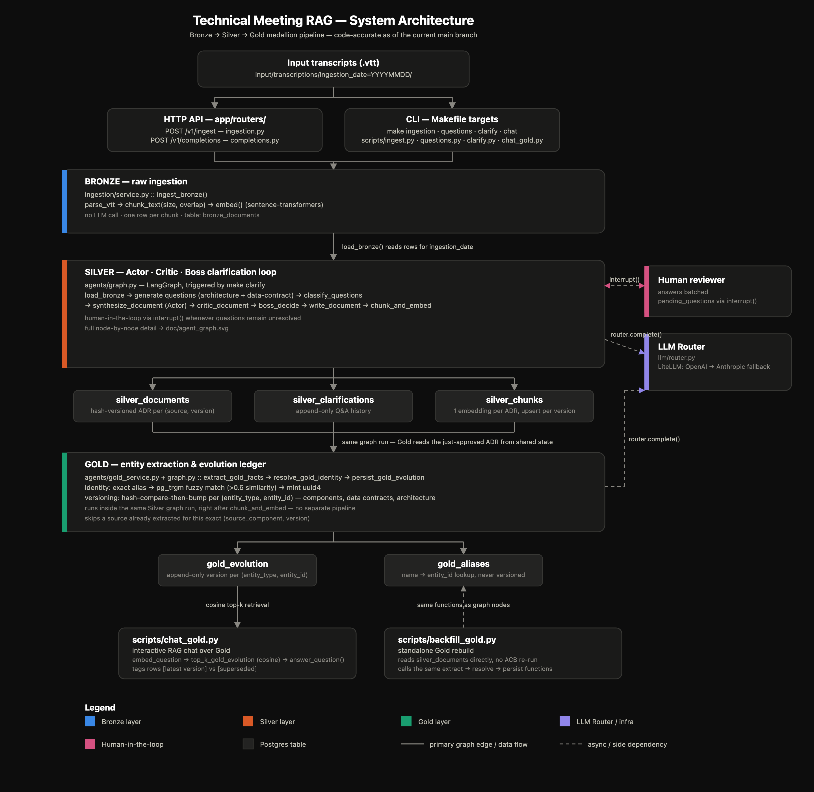
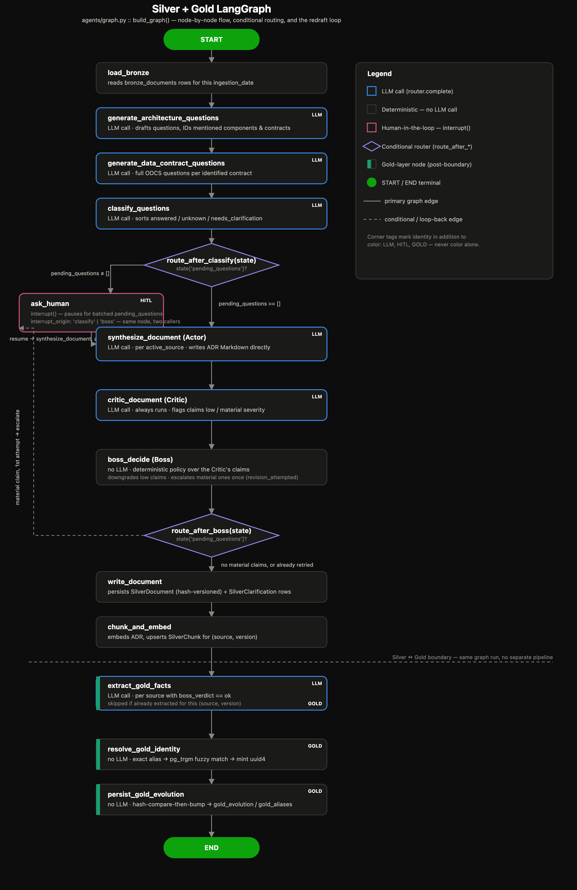

# technical_meeting_rag

Technical meetings about a system's architecture are scattered across many separate conversations, each told from a different angle — a backend engineer describing a service, a data engineer describing a pipeline, a frontend engineer describing a view — and each capturing only a partial, informal snapshot of the truth at that moment.

This project builds a **Medallion RAG Architecture** that ingests transcripts and a more clarified version as queryable knowledge base.

# Objective

For every architecture component mentioned across meetings, clarify **what it is**, whether it is **new**, an **evolution** of something already known, or **unchanged**, and produce two things Gold makes: an **Architecture Decision Record (ADR)** per evolution — capturing the context that motivated it, the alternatives considered, the trade-offs accepted, and the decision itself — and a **versioned record of each component**, instead of a flat, undated summary of what was said.

# Problems to resolve

* **Fragmented knowledge:** the same architecture gets described across dozens of separate meetings, with no single place that reflects the current, agreed-upon picture.
* **Ambiguity:** statements made in a meeting are often underspecified and cannot be trusted as a final definition of a component without further clarification.
* **Contradictions:** different meetings — or different people in the same meeting — describe the same component inconsistently, and nothing flags the conflict.
* **Architecture evolution over time:** components are described at different points in time; without ordering that timeline, it is unclear which description is still valid.
* **Implemented vs. planned confusion:** meetings mix what already exists with what is only intended, and that distinction is easy to lose once everything is summarized together.
* **Undocumented boundaries between teams:** the contracts and dependencies between profiles (e.g. what Data Engineering expects from Software Engineering) are usually implicit, never written down anywhere.
* **Restricted visibility:** some information is only meant to be seen by certain profiles due to organizational or permission boundaries, and a single flattened summary would leak or ignore that distinction.
* **Lack of traceability:** once a meeting is summarized by hand, it is normally impossible to trace a statement back to who said it, when, and in which conversation.
* **Manual alignment does not scale:** reconciling all of the above by hand, meeting after meeting, does not scale as the organization and its architecture grow.

# Clarification process: Agent & Human-in-the-loop collaboration

The project refine the final understanding of the organization asking to clarify following points:

1. **Clarify ambiguities:** Ask for items that are not clear enough and require additional information to properly define each component.
2. **Clarify contradictions:** Ask for items that are inconsistent between different tellings of the same component and require clarification or resolution.
3. **Clarify architecture evolution:** Clarify the timeline, components are described in different moments so project must order the evolution.
4. **Clarify subsystems:** Some components are described as part of a bigger system, so project must ask the boundaries and dependencies between them.
5. **Clarify implemented vs. planned:** Ask if components and capabilities that already exist and those that have not been implemented yet.

The goal is not simply to summarize a meeting, but to produce a **consistent, clarified record of the organization's architecture**, while explicitly identifying gaps, boundaries, dependencies, and inconsistencies.

Check document [doc/silver_process.md](doc/silver_process.md) for more details.

## Workflow

Input transcription > Clarification (LLM / Human) > Publish > Enrich RAG 

Although the workflow shows how user understands the flow, internally data follows a layered approach in PostgreSQL due to raw transcriptions are processed to store the raw data and then we clarify the information in a silver layer and finally we cover a synthesis of the architecture in gold layer.

```
                    ┌──────────────────────┐
                    │      RAW / Bronze    │
                    │                      │
Documents ─────────►│ original content     │
                    │ metadata             │
                    └──────────┬───────────┘
                               │
                               │ clarification agent process
                               ▼
                    ┌───────────────────────────┐
                    │ SILVER / Clarified input  │
                    │                           │
                    │ Summary chunking          │
                    │ metadata enritchment      │
                    │ generated data contracts  │
                    └──────────┬────────────────┘
                               │
                               │ semantic refinement
                               ▼
                    ┌────────────────────────────────────┐
                    │ GOLD / ADR: versioned components   │
                    │                                    │
                    │ Structure-aware chunking           │
                    │ Versions                           │
                    │ metadata enritchment               │
                    │ Component graph                    │
                    └────────────────────────────────────┘
```

## Expected questions to resolve

* When the component X was introduced in the company?
* Show me the general architecture diagram
* Who is responsible for the component X?
* Add a new component Y with [X, Z] dependencies and following model [...]
* Let me know the list of persons talking about the component X
* Let me know the details of the component X, including its dependencies and boundaries

## Guardrails

Identify items that are hidden due to permissions or organizational boundaries, where some components are visible to certain profiles but not to others.

## Samples

* Synthetic transcriptions: Specific descriptions for managing unit tests and verify expected behavior from different descriptions.
* Youtube transcriptions: Only to process real transcriptions that are very different from each other the youtube transcriptions will be used as input.
   These transcripts will be processed to generate the clarified architecture record, applying the same guardrails to identify missing information, inconsistencies, implementation status, and boundaries between profiles.

```
# Download a video's transcript; its session is derived from the video's own
# YouTube upload_date (input/transcriptions/session=<upload_date>/)
python3 scripts/download_transcript.py "https://www.youtube.com/watch?v=04uC4zrU10k"

# Re-download every link already tracked in input/links.json
python3 scripts/download_transcript.py

# ...or only the ones uploaded on a given date
python3 scripts/download_transcript.py --session 20260906
```
  
## User interface

Once user authenticates in a session (isolating information) to show different tabs:

* Input transcription: Upload transcriptions and pdfs for the same meeting, to be processed and clarified.
* Architecture history: Browse every ADR published so far, and the current architecture diagram built live from Gold's own components.
* Chat with RAG: Once an ADR is published the user can ask questions about architecture and all the timeline of components.
* Test  monitor (only when confiration enables start_test_mode setting): Monitor the list of tests and token consumption for all application.

# Glosary of terms

* **Component** — Any part of the organization's architecture that gets discussed in a
  meeting: a service, a system, a pipeline, a queue. Tracking what is known about each one,
  meeting after meeting, is the whole point of this project.

* **Data Contract** — The agreed interface between two components: who produces a piece of
  data, who consumes it, and what shape it has. Meetings usually describe these only
  implicitly ("Team A sends order events to Team B"); this project makes them explicit and
  keeps them versioned.

* **Architecture Decision Record (ADR)** — The written record of one decision about a
  component: what changed, why, what alternatives were considered, and what trade-offs were
  accepted. One is produced whenever a component's story evolves.

* **Entity** — The general name for anything this project keeps a history for: a component,
  a data contract, or the architecture as a whole. Every entity has its own identity and its
  own version history, independent of the others.

* **Evolution** — What happened to an entity between one meeting and the next: it is
  brand **new**, it **changed** (an evolution of something already known), it was
  **removed**, or it stayed **unchanged**. Every evolution is kept on record — nothing is
  ever silently overwritten.

* **Clarification** — A question raised about something a meeting left ambiguous,
  contradictory, or unresolved, together with the answer that resolves it — whether that
  answer comes from a later meeting or from a person asked directly.

* **Bronze / Silver / Gold** — The three stages a piece of information passes through:
  Bronze is a meeting exactly as it was said; Silver is that meeting once its ambiguities
  are clarified and turned into an ADR document; Gold is the versioned picture of each
  entity, built up from every Silver ADR over time.

# Architecture

A single FastAPI application backed by Postgres (`pgvector` for embeddings) and a LangGraph agent
that carries a transcript batch through the full Bronze → Silver → Gold pipeline in one run;
Streamlit is the UI layer (see `## User interface` above and `frontend/`), calling the backend
through `app/routers/frontend.py`. There is no real user system behind login — see
GETTING_STARTED.md's "Frontend usage" section for the two example accounts and their tenants.

### System diagram



### Agent graph



### Layers

One LangGraph run carries a transcript batch through all three layers — Gold is not a separate
pipeline, it is the last three nodes of the same graph run that wrote Silver.

| Layer | Owns | Table(s) | Module |
| --- | --- | --- | --- |
| Bronze | Raw ingestion, no interpretation | `bronze_documents` | `ingestion/service.py` |
| Silver | Actor–Critic–Boss clarification loop, versioned ADR per source | `silver_documents`, `silver_clarifications`, `silver_chunks` | `agents/graph.py` |
| Gold | Cross-meeting entity identity & evolution ledger | `gold_evolution`, `gold_aliases` | `agents/gold_service.py` |

### Key technical decisions

Engineering decisions made for this project itself — not to be confused with the ADRs the
pipeline produces *about the meetings it ingests*.

* **RAG, not CAG.** The corpus grows unbounded as new meetings are ingested over time, and access
  to a component's description must be restricted per profile/permission boundary (see
  `## Guardrails` above). Stuffing the whole corpus into a cached context defeats both: it doesn't
  scale past a context window, and it can't withhold a chunk from a query it shouldn't answer.
  Retrieval-per-query is what makes both the growth and the access boundary tractable.

* **Medallion layering (Bronze → Silver → Gold), all three implemented.** Bronze never interprets;
  Silver runs the clarification loop and produces one versioned ADR per transcript; Gold resolves
  every mentioned component/data-contract to a stable identity across meetings and keeps an
  append-only evolution ledger per entity — implemented in `agents/gold_service.py` and the last
  three nodes of `agents/graph.py`.

* **Actor–Critic–Boss as one LangGraph run, not three services.** `synthesize_document` (Actor)
  drafts the ADR, `critic_document` (Critic) always runs and flags claims by severity, and
  `boss_decide` (Boss, no LLM call — a deterministic policy) either downgrades low-severity claims
  in place or escalates a material one to a human. Keeping this as one graph run means the
  redraft loop shares state (`revision_attempted`) directly instead of coordinating it across
  service boundaries, and `revision_attempted` caps escalation at one retry per source so the loop
  can't spin forever on a claim the human's answer didn't actually resolve.

* **Question generation is two sequential LLM stages, not one.** The first call reads the
  transcript and asks one question per component actually named, while only *identifying* (never
  fully specifying) every data contract in play (`prompts/architecture_questions.jinja`). The
  second takes exactly those identified contracts and drafts the full ODCS-completeness question
  set for each one (`prompts/data_contract_questions.jinja`). Splitting them fixed an observed
  failure mode where a single combined pass regularly under-covered data contracts — see
  `doc/cost_analysis.md`.

* **Clarification is LLM-first; a human is only asked what the LLM couldn't resolve.** One
  classification call sorts every drafted question into `answered` / `unknown` /
  `needs_clarification`; only the last group reaches a human, batched into a single LangGraph
  `interrupt()`. The same `ask_human` node is reused for both the classify-stage gap-filling and a
  Boss escalation — one interrupt mechanism, one Postgres-backed checkpointer, no second pause
  path for the second case.

* **Gold identity resolution is deterministic, not an LLM call.** A mentioned name is resolved via
  exact match on `gold_aliases.alias`, then `pg_trgm` fuzzy match, and only then does it mint a new
  `entity_id`. This keeps identity resolution auditable (every alias variant a component was ever
  called is a row you can inspect) and cheap — no LLM round-trip just to decide whether "the auth
  service" and "Auth Service" are the same entity.

* **Gold versioning is hash-compare-then-bump per entity, not per document.** `SilverDocument`
  versions the whole ADR; `GoldEvolution` versions each component, data contract, and
  architecture-per-source independently via `entity_hash`. A change to one component's narrative
  doesn't bump every other entity mentioned in the same document, so "how has X evolved" is a
  query against X's own version history, never a diff across unrelated entities.

* **No foreign keys between layers.** `source_component`/`source_adr_version`/`ingestion_date` are
  flat columns copied forward at write time (Bronze → Silver → Gold), the same convention
  throughout. This trades referential-integrity enforcement for join-free traceability queries and
  event-time correctness (`ingestion_date` stays the meeting date, not a processing timestamp),
  which matters more here since nothing in this pipeline ever deletes or re-parents a row.

* **LiteLLM router with OpenAI → Anthropic fallback** (`llm/router.py`), so a single provider
  outage doesn't stop ingestion or clarification.

# Key Metrics

Quality gates defined for the RAG pipeline (Phase 6 of `.tmp/tasks.md` — not yet implemented;
tracked here so the target is explicit before the tests are written):

| Metric                                       | What it catches                                                                    | Threshold |
| --------------------------------------------- | ----------------------------------------------------------------------------------- | --------- |
| Top-k / distance-metric / filter correctness  | Off-by-one top-k, wrong similarity ordering, a profile/session filter letting the wrong chunks through | Exact match against hand-computed expectations |
| ANN index recall@k vs. brute-force            | An under-tuned pgvector index (HNSW/IVFFlat) silently dropping the one chunk that mattered | ≥ 0.95 |
| RAGAS faithfulness                            | The answer contains a claim the retrieved chunks don't support (hallucination)     | Documented per-metric minimum, gates merges (`eval/thresholds.yaml`) |
| RAGAS context precision                       | Retrieved chunks are mostly irrelevant padding                                     | ″ |
| RAGAS context recall                          | Retrieved chunks miss something the reference answer needed                        | ″ |
| Guardrail leakage                             | A profile-restricted chunk reaches an answer generated for a different profile, even paraphrased | Zero tolerance — any leak is a fail, not a threshold |


# Integration

MCP for each output for internal agents

# Next steps

* Two users are only included, this should evolve to manage multiple users and multi tenant architecture.