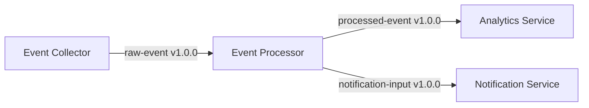
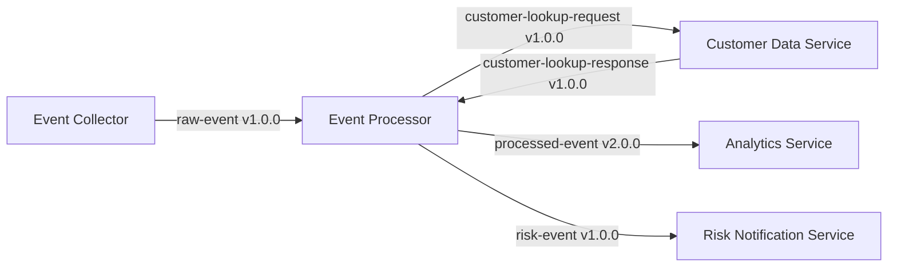

# ADR — Migración del procesamiento de eventos a un procesador enriquecido

## 1. ADR

### Context

El procesamiento actual recibe eventos desde `Event Collector`, los procesa mediante `Event Processor` y los envía a `Analytics Service` y `Notification Service`.

Se requiere enriquecer el procesamiento con información de clientes y evaluación de riesgo. Para ello se incorpora un nuevo `Customer Data Service` y un nuevo `Risk Notification Service`.

Como consecuencia, algunos Data Contracts permanecen sin cambios, otros son nuevos y el contrato `processed-event` debe evolucionar de **v1.0.0 a v2.0.0**.

### Decision

- Modificar `Event Processor` para realizar consultas al nuevo `Customer Data Service`.
- Incorporar información de cliente y riesgo al evento procesado.
- Sustituir `Notification Service` por `Risk Notification Service`.
- Crear los contratos necesarios para las nuevas interacciones.
- Evolucionar `processed-event` de **v1.0.0 a v2.0.0**.
- Deprecar `processed-event` v1.0.0.
- Mantener `raw-event` v1.0.0 sin cambios.
- Introducir `risk-event` v1.0.0 para comunicar eventos de riesgo alto.

### Consequences

- `Event Processor` pasa a depender de `Customer Data Service`.
- Se introducen nuevos Data Contracts.
- Los consumidores de `processed-event` deben adaptarse a la versión 2.0.0.
- `processed-event` v1.0.0 queda deprecated.
- `Notification Service` deja de formar parte de la arquitectura.
- Se introduce un flujo específico para eventos de riesgo.

---

## 2. Previous Architecture



---

## 3. Target Architecture



---

## 4. Affected Components

| Component | Change | Description |
|---|---|---|
| `Event Processor` | **MODIFIED** | Enriches events using customer information and calculates risk |
| `Analytics Service` | **MODIFIED** | Consumes `processed-event` v2.0.0 |
| `Customer Data Service` | **NEW** | Provides customer information to the Event Processor |
| `Risk Notification Service` | **NEW** | Processes high-risk events |
| `Notification Service` | **REMOVED** | Replaced by Risk Notification Service |

---

## 5. Affected Data Contracts

| Data Contract | Component | Change | Version |
|---|---|---|---|
| `raw-event` | Event Collector → Event Processor | **UNCHANGED** | `1.0.0` |
| `customer-lookup-request` | Event Processor → Customer Data Service | **NEW** | `1.0.0` |
| `customer-lookup-response` | Customer Data Service → Event Processor | **NEW** | `1.0.0` |
| `processed-event` | Event Processor → Analytics Service | **MODIFIED** | **`1.0.0 → 2.0.0`** |
| `risk-event` | Event Processor → Risk Notification Service | **NEW** | `1.0.0` |
| `processed-event` | Event Processor → Analytics Service | **DEPRECATED** | `1.0.0` |
| `notification-input` | Event Processor → Notification Service | **REMOVED** | `1.0.0` |

> **Versioning:** cuando un Data Contract cambia, se debe indicar explícitamente la versión anterior, la nueva versión y el motivo del incremento de versión.

---

## 6. ODCS Data Contract Specifications

### 6.1 `raw-event` — Unchanged

**Action:** `UNCHANGED`  
**Version:** `1.0.0`  
**Producer:** `Event Collector`  
**Consumer:** `Event Processor`

```yaml
apiVersion: v3.1.0
kind: DataContract

name: raw-event
version: 1.0.0
status: active

description: Raw event received from the event collector.

schema:
  type: object
  properties:
    event_id:
      type: string
      required: true
      description: Unique identifier of the event.

    timestamp:
      type: string
      format: date-time
      required: true

    payload:
      type: object
      required: true
```

---

### 6.2 `customer-lookup-request` — New

**Action:** `NEW`  
**Version:** `1.0.0`  
**Producer:** `Event Processor`  
**Consumer:** `Customer Data Service`

```yaml
apiVersion: v3.1.0
kind: DataContract

name: customer-lookup-request
version: 1.0.0
status: active

description: Request for retrieving customer information.

schema:
  type: object
  properties:
    customer_id:
      type: string
      required: true
      description: Identifier of the customer to retrieve.
```

---

### 6.3 `customer-lookup-response` — New

**Action:** `NEW`  
**Version:** `1.0.0`  
**Producer:** `Customer Data Service`  
**Consumer:** `Event Processor`

```yaml
apiVersion: v3.1.0
kind: DataContract

name: customer-lookup-response
version: 1.0.0
status: active

description: Customer information returned by the Customer Data Service.

schema:
  type: object
  properties:
    customer_id:
      type: string
      required: true

    customer_type:
      type: string
      required: true

    country:
      type: string
      required: false

    segment:
      type: string
      required: false
```

---

### 6.4 `processed-event` — Modified

**Action:** `MODIFIED`  
**Previous version:** `1.0.0`  
**New version:** **`2.0.0`**  
**Producer:** `Event Processor`  
**Consumer:** `Analytics Service`

#### Version change

`processed-event` changes from **v1.0.0 → v2.0.0** because the contract is extended with customer enrichment and risk information.

```yaml
apiVersion: v3.1.0
kind: DataContract

name: processed-event
version: 2.0.0
status: active

description: >
  Enriched processed event containing customer and risk information.

previousVersion: 1.0.0

schema:
  type: object

  properties:

    event_id:
      type: string
      required: true
      description: Unique identifier of the event.

    timestamp:
      type: string
      format: date-time
      required: true

    customer_id:
      type: string
      required: false
      description: Customer associated with the event.

    customer_type:
      type: string
      required: false
      description: Type of the customer.

    customer_segment:
      type: string
      required: false
      description: Customer segment obtained from Customer Data Service.

    risk_level:
      type: string
      required: false
      enum:
        - LOW
        - MEDIUM
        - HIGH
      description: Risk level calculated for the event.

    risk_score:
      type: number
      required: false
      description: Numerical risk score.

versioning:
  previousVersion: 1.0.0
  currentVersion: 2.0.0
  changeReason: >
    Customer enrichment and risk information have been added
    to the processed event.
```

#### Contract evolution

```text
processed-event v1.0.0
        │
        │  + customer information
        │  + risk information
        ▼
processed-event v2.0.0
```

---

### 6.5 `risk-event` — New

**Action:** `NEW`  
**Version:** `1.0.0`  
**Producer:** `Event Processor`  
**Consumer:** `Risk Notification Service`

```yaml
apiVersion: v3.1.0
kind: DataContract

name: risk-event
version: 1.0.0
status: active

description: Event generated when a high-risk event is detected.

schema:
  type: object

  properties:

    event_id:
      type: string
      required: true

    customer_id:
      type: string
      required: true

    risk_level:
      type: string
      required: true
      enum:
        - HIGH

    risk_score:
      type: number
      required: true

    detected_at:
      type: string
      format: date-time
      required: true
```

---

### 6.6 `processed-event` v1.0.0 — Deprecated

**Action:** `DEPRECATED`  
**Version:** `1.0.0`  
**Replacement:** `processed-event` v2.0.0

```yaml
apiVersion: v3.1.0
kind: DataContract

name: processed-event
version: 1.0.0
status: deprecated

description: Previous version of the processed event contract.

deprecatedBy:
  name: processed-event
  version: 2.0.0

schema:
  type: object

  properties:

    event_id:
      type: string
      required: true

    timestamp:
      type: string
      format: date-time
      required: true

    payload:
      type: object
      required: true
```

---

### 6.7 `notification-input` — Removed

**Action:** `REMOVED`  
**Version:** `1.0.0`  
**Producer:** `Event Processor`  
**Consumer:** `Notification Service`

```yaml
apiVersion: v3.1.0
kind: DataContract

name: notification-input
version: 1.0.0
status: retired

description: >
  Contract previously used to send notifications.
  It is removed because Notification Service has been replaced
  by Risk Notification Service.
```

---

## 7. ODCS Artifacts

```text
contracts/
├── raw-event/
│   └── v1.0.0.yaml
│
├── customer-lookup-request/
│   └── v1.0.0.yaml
│
├── customer-lookup-response/
│   └── v1.0.0.yaml
│
├── processed-event/
│   ├── v1.0.0.yaml
│   └── v2.0.0.yaml
│
├── risk-event/
│   └── v1.0.0.yaml
│
└── notification-input/
    └── v1.0.0.yaml
```