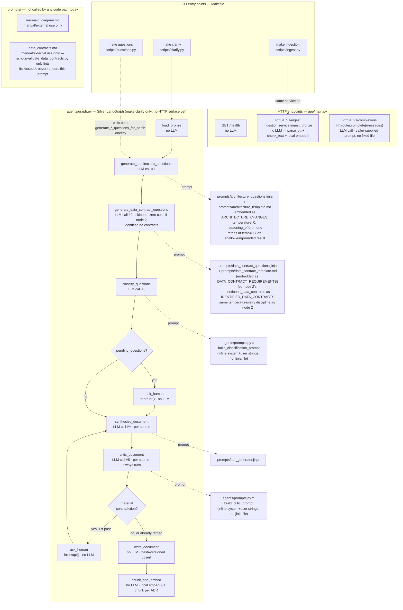

# Agents / endpoints — LLM call flow

Every place this codebase actually calls an LLM today, and the exact prompt each call uses.
Complements `doc/silver_process.md` (which covers the Silver graph alone, node by node) with the
wider picture: HTTP endpoints, CLI entry points, and where each one does or doesn't touch an LLM.

