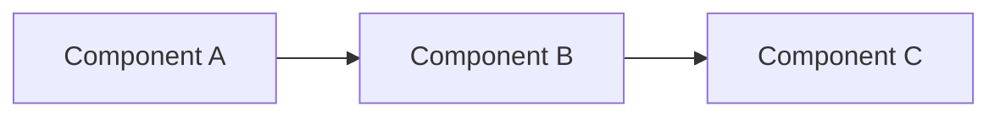

# Architecture Description / Evolution

## 1. Metadata

| Field                              | Description                                                                |
| ---------------------------------- | -------------------------------------------------------------------------- |
| **Date**                           | Date of the architecture description or evolution                          |
| **Participants**                   | People involved in defining or reviewing the architecture                  |
| **Status**                         | `Proposed` / `Accepted` / `Implemented` / `Superseded`                     |
| **Scope**                          | `Global` / `Subsystem` / `Component`                                       |
| **Type**                           | `Current Architecture` / `Architecture Evolution`                          |
| **Affected Components**            | Components that are added, modified, removed, or whose dependencies change |
| **Related ADRs**                   | ADRs related to this architecture or evolution                             |
| **Related Architecture Documents** | Related architecture specifications or diagrams                            |

---

## 2. Summary

### Description

<!-- Brief description of the architecture or architecture evolution -->

### Motivation

<!-- Why does this architecture exist or why is this evolution needed? -->

### Expected Outcome

<!-- What should be achieved after implementing this architecture/evolution? -->

---

## 3. Scope

### Scope Level

<!-- Global, subsystem, component, etc. -->

### In Scope

<!-- Components, systems, data flows, processes, or capabilities covered by this document -->

### Out of Scope

<!-- Explicitly excluded elements -->

---

## 4. Affected Components

List all components affected by this architecture or evolution.

| Component   | Change                           | Dependencies | Description |
| ----------- | -------------------------------- | ------------ | ----------- |
| Component A | `Added` / `Modified` / `Removed` | Component B  | Description |
| Component B | `Modified`                       | Component C  | Description |

### Dependency Changes

<!-- Describe new, removed, or modified dependencies -->

---

## 5. Open Data Contracts

List the [Open Data Contract Standard (ODCS)](https://bitol-io.github.io/open-data-contract-standard/) JSON files resulting from this architecture or evolution.

| Contract          | Version | Change     | Description |
| ----------------- | ------- | ---------- | ----------- |
| `contract-a.json` | `1.0.0` | `Added`         | Description |
| `contract-b.json` | `1.1.0` | `Forward-update` | Description |

### Contract Changes

<!-- Describe new, forward-updated, break-changed, deprecated, or removed data contracts -->

---

# 6. Architecture

<!-- This section describes the resulting architecture. -->

## 6.1 Architecture Diagram

## 6.2 Components

### Component A

**Purpose**

<!-- What is the responsibility of this component? -->

**Inputs**

<!-- Inputs / dependencies -->

**Outputs**

<!-- Outputs / interfaces / data products -->

**Dependencies**

<!-- Dependencies on other components -->

### Component B

<!-- Repeat as necessary -->

---

## 6.3 Data Flows

<!-- Describe the relevant data flows between components. -->

## 6.4 Interfaces

<!-- APIs, events, queues, contracts, protocols, etc. -->

## 6.5 Non-Functional Requirements

| Requirement   | Target |
| ------------- | ------ |
| Performance   |        |
| Availability  |        |
| Scalability   |        |
| Security      |        |
| Observability |        |
| Cost          |        |

---

# 7. Architecture Evolution / ADR

> This section is required when `Type = Architecture Evolution`.
>
> If this document only describes an already implemented architecture, this section can be omitted.

## 7.1 Context and Problem

### What problem are we trying to solve?

<!-- Describe the problem -->

### Why do we need to solve it now?

<!-- Business, technical, operational, regulatory, or other drivers -->

### What requirements or constraints do we have?

<!-- Technical, business, organizational, operational, regulatory constraints -->

### What happens if we do nothing?

<!-- Consequences of maintaining the current architecture -->

### Which parts of the system are affected?

<!-- Components, systems, data, teams, processes -->

### Are there previous decisions that constrain this decision?

<!-- Reference previous ADRs or architectural decisions -->

---

## 7.2 Alternatives

### Alternative 1 — Recommended

**Description**

<!-- Describe the proposed solution -->

**Advantages**

*
*
*

**Disadvantages**

*
*
*

### Alternative 2

**Description**

<!-- Describe the alternative -->

**Advantages**

*
*
*

**Disadvantages**

*
*
*

### Alternative 3

**Description**

<!-- Describe the alternative -->

**Advantages**

*
*
*

**Disadvantages**

*
*
*

### Rejected Alternatives

| Alternative   | Reason for Rejection |
| ------------- | -------------------- |
| Alternative X |                      |
| Alternative Y |                      |

---

## 7.3 Decision Criteria

What criteria are used to evaluate the alternatives?

| Criterion       | Priority            | Description |
| --------------- | ------------------- | ----------- |
| Cost            | High / Medium / Low |             |
| Performance     | High / Medium / Low |             |
| Simplicity      | High / Medium / Low |             |
| Maintainability | High / Medium / Low |             |
| Security        | High / Medium / Low |             |
| Scalability     | High / Medium / Low |             |
| Operability     | High / Medium / Low |             |
| Vendor Lock-in  | High / Medium / Low |             |

### Key Questions

* What are the most important criteria for this decision?
* Which requirements are **must-have**?
* What are we optimizing for?
* Which trade-offs are we willing to accept?
* Which trade-offs are unacceptable?

---

## 7.4 Decision

### Decision

<!-- State the decision explicitly and concisely. -->

**We will:**

> <!-- One or two sentences describing the decision -->

### Rationale

<!-- Why was this alternative selected? -->

---

## 7.5 Consequences

### Positive Consequences

*
*
*

### Negative Consequences

*
*
*

### Trade-offs

<!-- Explicitly describe what we gain and what we sacrifice. -->

### Technical Debt

<!-- Technical debt introduced or reduced by this decision -->

---

## 7.6 Risks and Assumptions

### Risks

| Risk | Impact              | Probability         | Mitigation |
| ---- | ------------------- | ------------------- | ---------- |
|      | High / Medium / Low | High / Medium / Low |            |

### Assumptions

*
*
*

### Decision Reversal Conditions

<!-- What would need to change for this decision to become invalid? -->

Examples:

* Performance falls below X.
* Cost exceeds Y.
* A dependency is deprecated.
* A new technology provides significantly better capabilities.
* The expected scale changes significantly.

---

## 7.7 Implementation

### Changes Required

* [ ] New components
* [ ] Modified components
* [ ] Removed components
* [ ] New data contracts
* [ ] Modified data contracts
* [ ] Infrastructure changes
* [ ] Configuration changes
* [ ] Migration required
* [ ] Documentation updated
* [ ] Monitoring / observability updated

### Migration Strategy

<!-- Describe how the current architecture will transition to the new architecture. -->

### Rollback Strategy

<!-- Describe how the evolution can be reverted if necessary. -->

---

# 8. Validation

### How will we know the decision was successful?

| Metric | Current | Target | Measurement |
| ------ | ------: | -----: | ----------- |
|        |         |        |             |

### Validation / Acceptance Criteria

* [ ]
* [ ]
* [ ]

---

# 9. Decision Record

| Field              | Value                                               |
| ------------------ | --------------------------------------------------- |
| **Decision**       |                                                     |
| **Decision Date**  |                                                     |
| **Decision Owner** |                                                     |
| **Status**         | `Proposed` / `Accepted` / `Rejected` / `Superseded` |
| **Supersedes**     |                                                     |
| **Superseded By**  |                                                     |
| **Review Date**    |                                                     |

---

# 10. References

* Architecture diagrams:
* ADRs:
* Data contracts:
* Technical documentation:
* External references:

# 11. Mentions

@person1, @person2, ...